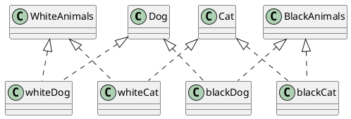
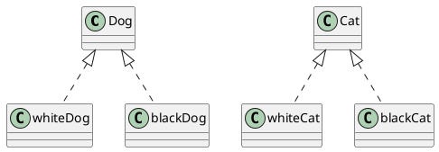
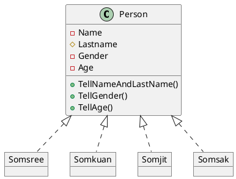
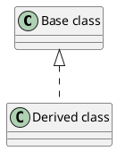
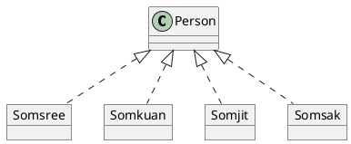
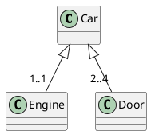
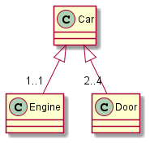

# Assignment
 Assignment นี้เป็นการรวม Assignment ของเนื้อหาในสองสัปดาห์ที่เรียนเรื่อง Abstraction  


----
## 1. ให้นำโค้ดต่อไปนี้ไป render ให้เป็น class diagram แล้วนำผลที่ได้มาใส่ใน markdown##
   
   a. ใช้โปรแกรม plantUML บนเว็บ

   b. ใช้ extension ใน VScode
   
   c. ใช้โปรแกรม PlantUML.jar ที่ดาวน์โหลดมาทำงานแบบ offline บนเครื่องของนักศึกษาเอง

### 1.1 Code ของตัวอย่างที่ 3 (สไลด์ที่ 19) ###



#### ผลที่ได้จากการ render สไลด์ 19 ####


^^^ บันทึกผลของนักศึกษาลงไปแทนภาพนี้

### 1.2 Code ของตัวอย่าง ปรับปรุงการทำ Classification ของหมาและแมว (สไลด์ที่ 20) ###



#### ผลที่ได้จากการ render สไลด์ 20 ####


^^^ บันทึกผลของนักศึกษาลงไปแทนภาพนี้


#### หมายเหตุ การใช้ลูกศรสามเหลี่ยมที่มีหัวโปร่งใสคือการทำ Inheritance ####


### 1.3 Classification ของ class คน (สไลด์ที่ 21) ###



#### ผลที่ได้จากการ render สไลด์ 21 ####


^^^ บันทึกผลของนักศึกษาลงไปแทนภาพนี้

#### หมายเหตุ การใช้ลูกศรสามเหลี่ยมที่มีหัวโปร่งใสและเส้นประคือการทำ Instantiation (สร้างวัตถุ) ####





### 1.4 การสร้างวัตถุจาก Class คน  (สไลด์ที่ 22) ###


#### ตัวอย่างผลที่ได้จากการ render สไลด์ 22 ####


--- 
## 2. ให้แก้ไข code ไฟล์ puml เพื่อให้ได้ภาพตามสไลด์ต่อไปนี้  ##

### 2.1 สไลด์หมายเลข 44 ###

@startuml 
class classroom{}
class Whiteboard{}
class Table{}
class Chair{}
class Student{}
class Teacher{}

classroom o-- Whiteboard
classroom o-- Table
classroom o-- Chair
classroom o-- Student
classroom o-- Teacher
@enduml 
```


### 2.2 สไลด์หมายเลข 45 ###

@startuml 
class MotorBoat{}
class Car{}
class Helm{}
class Engine{}
class Door{}
class Wheel{}
class SteeringWheel{}

MotorBoat o-- Helm
MotorBoat o-- Engine

Car o-- Engine
Car o-- Door
Car o-- Wheel
Car o-- SteeringWheel
@enduml 
```


### 2.3 สไลด์หมายเลข 51 ###

@startuml 
class Car{}
class Engine{}
class Wheel{}
class AirConditionner{}

Car o-- "1..1" Engine
Car o-- "2..4" Door
Car o-- "4..4" Wheel
Car o-- "0..1" AirConditionner
@enduml  
```


#### หมายเหตุ การเขียน cardinality ทำได้โดยใช้รูปแบบดังต่อไปนี้ ####


ซึ่งจะได้ไดอะแกรมดังรูป




### 2.4 Aggregation ของคลาส หนังสือ  (สไลด์หมายเลข 54) ###

@startuml 
class Book{}
class Cover{}
class Introduction{}
class Index{}
class Content{}
class Bibliography{}

Book o-- "2..2" Cover
Book o-- "1..1" Introduction
Book o-- "1..1" Index
Book o-- "1..N" Content
Book o-- "1..1" Bibliography
@enduml 
```


### 2.5 เพิ่ม Attribute และ Method ให้กับ Class หนังสือ   (สไลด์หมายเลข 56) ###
@startuml 
class Book{
    - ISBN 
    - Name
    + Read()
    + Print()
}

class Cover{
    + CoverType
    + Flip()
}

class Introduction{
    - TextMessage
    - AuthorName
    + Read()
}

class Index{
    - TextMessage
    + Read()
}

class Chapter{
    - ContentofChapter
    + Read()
}

class Bibliography{
    - TextMessage
    + Read()
}

class Page{
    - ContentofPage
    + Flip()
    + Read()
}

class Picture{
    - Image
    + See()
}

class Font{
    - Character
    + Spell()
}

Book o-- Cover
Book o-- Introduction
Book o-- Index
Book o-- Chapter
Book o-- Bibliography
Chapter o-- Page
Page o-- Picture
Page o-- Font
@enduml  
```


### 2.6 ใช้ plantUML วาดภาพตาม สไลด์หมายเลข 71 ###


### 2.7 ใช้ plantUML วาดภาพตาม สไลด์หมายเลข 76 ###

### 2.8 ใช้ plantUML วาดภาพตาม สไลด์หมายเลข 78 ###


### 2.9 ใช้ plantUML วาดภาพตาม สไลด์หมายเลข 95 ###


---
