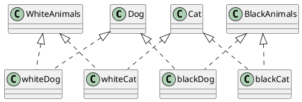
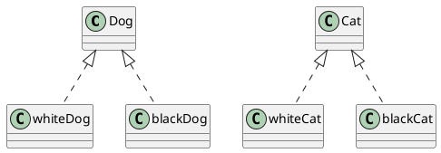
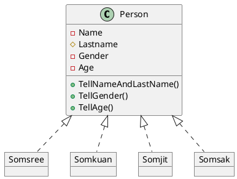
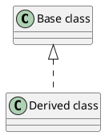

# Assignment

----
## 1. ให้นำโค้ดต่อไปนี้ไป render ให้เป็น class diagram ##
   a. ใช้โปรแกรม plantUML บนเว็บ
   b. ใช้ extension ใน VScode
   c. ใช้โปรแกรม PlantUML.jar ที่ดาวน์โหลดมาทำงานแบบ offline บนเครื่องของนักศึกษาเอง

### 1.1 Code ของตัวอย่างที่ 3 (สไลด์ที่ 19) ###

#### ตัวอย่างผลที่ได้จากการ render สไลด์ 19 ####

### 1.2 Code ของตัวอย่าง ปรับปรุงการทำ Classification ของหมาและแมว (สไลด์ที่ 20) ###

#### ตัวอย่างผลที่ได้จากการ render สไลด์ 20 ####

#### หมายเหตุ การใช้ลูกศรสามเหลี่ยมที่มีหัวโปร่งใสคือการทำ Inheritance ####

### 1.3 Classification ของ class คน (สไลด์ที่ 21) ###

#### ตัวอย่างผลที่ได้จากการ render สไลด์ 21 ####

#### หมายเหตุ การใช้ลูกศรสามเหลี่ยมที่มีหัวโปร่งใสและเส้นประคือการทำ Instantiation (สร้างวัตถุ) ####

----

